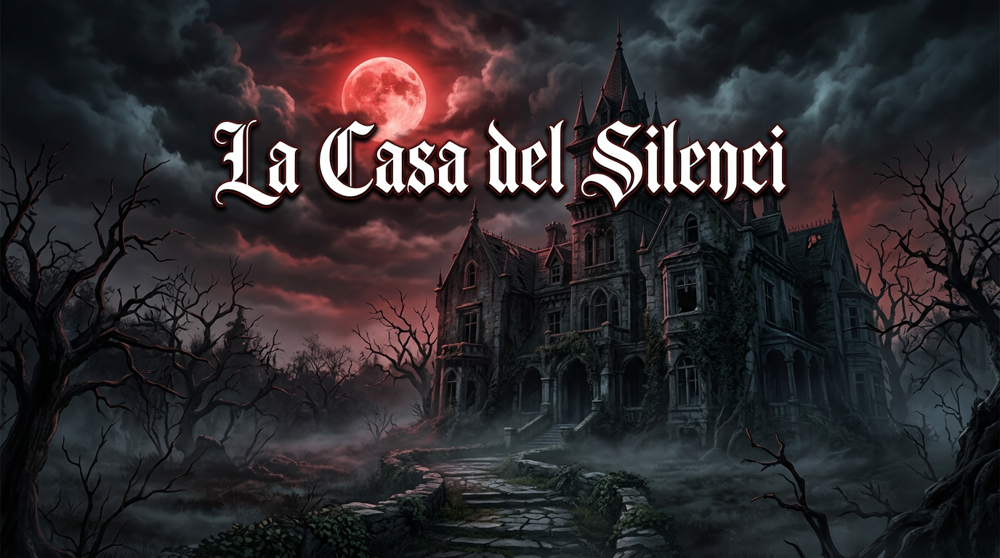

# La Casa del Silenci 🎮👻

**Visual Novel de Terror i Suspens** feta amb **Ren'Py** - Joc complet amb 10 escenes, 3 finals diferents i 15 minuts de gameplay intens.

## 📖 **Sinopsi**

Ets **Alex**, un investigador paranormal que entra a la **Casa Thornwood** per trobar **Sara**, desapareguda fa setmanes. La casa amaga secrets foscos: **Elena**, un esperit que pot ser aliada o enemiga, i el **Dr. Moreno**, l'antic propietari convertit en entitat maligna.

**Les teves decisions determinaran si sobrevives... o formes part de la casa per sempre.**

## ✨ **Característiques**

| Feature | Detalls |
|---------|---------|
| **10 Escenes** | Entrada, rebedor, biblioteca, soterrani, ritual... |
| **Personatges** | 3 principals (Alex, Elena, Moreno) + secundaris |
| **10 Decisions** | Amb conseqüències reals i 3 finals diferents |
| **Àudio Immersiu** | 6 temes musicals + 10 SFX contextuals |
| **Gameplay** | ~15 minuts, totalment jugable |
| **Visuals** | 15 imatges IA + interfície personalitzada terror |

## 🎮 **Com Jugar**

1. **Descarrega Ren'Py**: [renpy.org](https://www.renpy.org)
2. **Obre el projecte** o executa l'executable
3. **Pren decisions** - Cada elecció compta!
4. **Desbloqueja els 3 finals**:
   - **Final A**: Redempció (màxim)
   - **Final B**: Escapada
   - **Final C**: Atrapament (dolent)

## 📁 **Estructura del Projecte**

